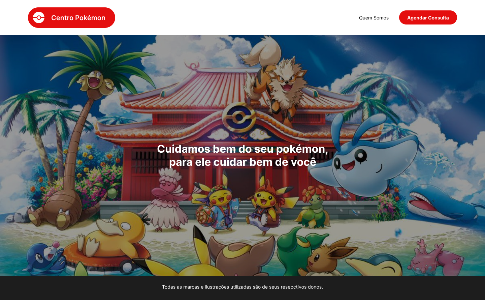
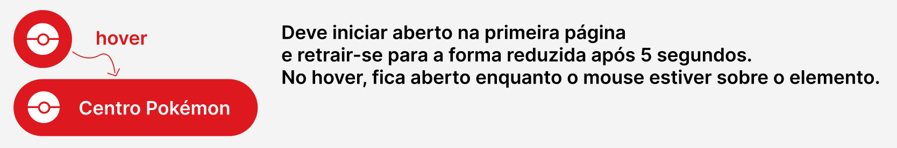

# CODIE

<details>
  <summary>
    <strong>🤷🏽‍♀️ Como entregar</strong>
  </summary><br>

- **Envie o repositório do projeto concluído para este linkedin:** [Fernando-Codie](https://www.linkedin.com/in/fernando-maziero/)

</details>

# Orientações

<details>
  <summary>
    <strong>🛠 Ferramentas</strong>
  </summary><br>
  
 - [TypeScript](https://www.typescriptlang.org/)
 - [Yup](https://www.npmjs.com/package/yup?activeTab=readme)
 - [PNPM](https://pnpm.io/installation)
 - [ReactJS](https://react.dev/)
 - [Axios](https://axios-http.com/docs/intro)
 - [NextJS](https://nextjs.org/)
 - [Swiper](https://swiperjs.com/demos)
 - [Dotenv](https://www.npmjs.com/package/dotenv)
 - [Toastify](https://www.npmjs.com/package/react-toastify)
 - [React-Hook-Form](https://react-hook-form.com/)
 - [Styled-Components](https://styled-components.com/)

</details>
 
Teste técnico para desenvolvimento frontend – React/NextJS.

## Setup

Instale as dependências do código com pnpm

## Inicie o projeto
```shell
pnpm run dev

```

## Objetivo

Desenvolver um web app em Typescript, a partir deste projeto nextjs (clone o repositório e desenvolva em cima dele), que implemente o design descrito na próxima seção.

### Requisitos
- Tratar possíveis erros de API
- Demonstrar conhecimento do uso de hooks
- Criar um código desacoplado, organizado e testável
- Demonstrar conhecimento de modularização de componentes
- Utilizar CSS in js – styled components para estilizar as páginas
- Demonstrar conhecimento de TypeScript e suas features para organizar o projeto
- Obrigatório o uso do react-hook-form + yup para o desenvolvimento do formulário
- Deve ser usado Page Router do next.js e não a nova versão >=14.0.0 no desenvolvimento deste projeto.
- Demonstrar organização, desacoplamento e separação de responsabilidades no código; obrigatório o uso de inversify + clean architecture

### Diferencial
- Demonstrar conhecimentos de técnicas específicas de NextJS para lidar com estilos e server-side rendering.
- Demonstrar em pelo menos 1 chamada de api o uso de SSR Next.js
- Demonstrar conhecimento com react-query.
- Demonstrar conhecimento em classes javascript POO.

### Uso de APIs
- Usar `http://localhost:3000/api/scheduling/date` para puxar as datas disponíveis para agendamento
- Usar `htttp://localhost:3000/api/scheduling/time` para puxar os horários disponíveis para agendamento
- Usar a [pokéAPI](https://pokeapi.co/) para trazer os dados de região, cidades, e pokémons a serem usados no agendamento

Entender o contrato das APIs é também parte do teste.

### Entrega
O prazo para entrega é de **07 dias**.

## Design a Ser Implementado
O site deve implementar o design descrito nas telas abaixo. Todas as imagens necessárias estão na pasta `./public/images`.

A fonte utilizada em todas as páginas, e inclusive no logo, é chamada `Inter` e está disponível no Google Fonts.

Este figma pode ser utilizado para consulta: https://www.figma.com/file/TxK6YkULMRyMCf6158VYNx/CODIE-TESTE-FRONT-END?type=design&node-id=0-1&mode=design&t=0dzPE2mRNqKfLXIg-0

### Home

Obs: O logo deve seguir o seguinte comportamento, iniciando expandido na home, e reduzindo após 05 segundos, da direita para a esquerda. Ele deve estar na forma reduzida nas demais páginas, abrindo no hover do mouse:

### Quem Somos

### Agendar Consulta

#### Caso de Sucesso

#### Caso de Falha
